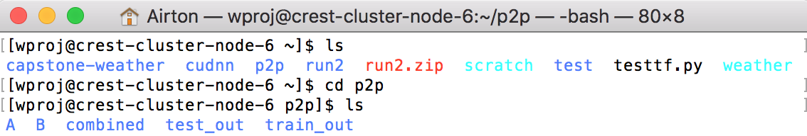

#  SSH Trouble

## Had many different errors that I had to fix (took a day)

### An example is the host identification  

 

In order to fix this I had to reset the host identification with the command: 

ssh-keygen -R *ip_address_or_hostname* 

### Show that I was able to get access into the servers 

  

Was able to access the servers and look at everything that was added so far and can now access the algorithm and run it there. 
